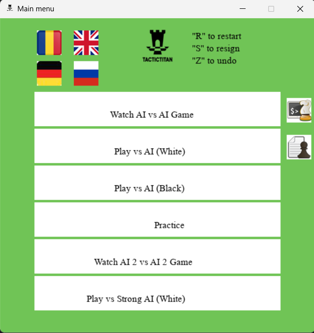
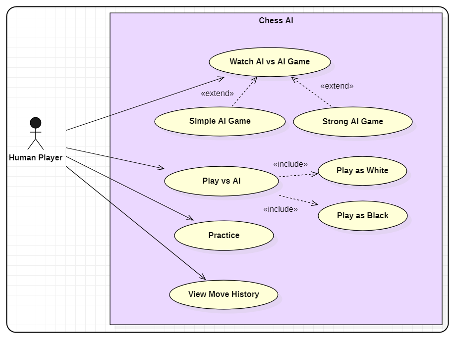

<h1>TacticTitan</h1>
Welcome to TacticTitan! This chess software is designed to enhance your chess experience through advanced algorithms and interactive features. Whether you want to spectate AI vs. AI games, challenge yourself against a powerful AI, or practice your skills, TacticTitan has you covered.

<h2>Features</h2>
<ol>
<li>Spectate AI vs. AI Games: Watch high-stakes chess matches with AI opponents at varying depths (2 and 5).</li> 
<li>Play Against AI: Challenge the AI with the option to play as White or Black.</li> 
<li>Practice Mode: Control both White and Black pieces in our practice mode to improve your skills.</li> 
<li>Challenge Stronger AI: Test your skills against a more powerful AI with a depth of 5. </li> 
</ol>

<h2>Algorithms</h2>
TacticTitan is powered by advanced algorithms that enhance its gameplay:  
<ol>
<li>Negamax Algorithm: Efficiently evaluates and decides optimal moves for AI players.  </li>
<li>MinMax Algorithm: Provides strategic depth by evaluating possible moves and counter-moves.  </li>
</ol>
 

<h2>Installation</h2>
To get started with TacticTitan, follow these steps: 

<ol>
   
<li>Clone the repository:   git clone https://github.com/aryasadawrate19/Tactic-Titan.git </li>
 
<li> Navigate to the project directory:   cd Tactic-Titan</li>
 
<li>Install the required dependencies. You can find the list of dependencies in the requirements.txt file. Install them using:   pip install -r requirements.txt</li>
 
<li>Run the application. You may need to use the provided script or executable specific to your operating system.</li>
  
</ol>

<h2>Usage</h2>
<ol>
<li>Launch TacticTitan by running the application script.</li>
<li>Use the menu to select your preferred mode of play or spectate AI games.</li>
<li>Explore the different features to enhance your chess experience.</li>
  
</ol>

<h2>Contributions</h2>
Contributions are welcome! If you have suggestions for improvements or new features, please open an issue or submit a pull request.

<h2>Contact</h2>
For any questions or feedback, feel free to contact me on my social media handles on my profile

